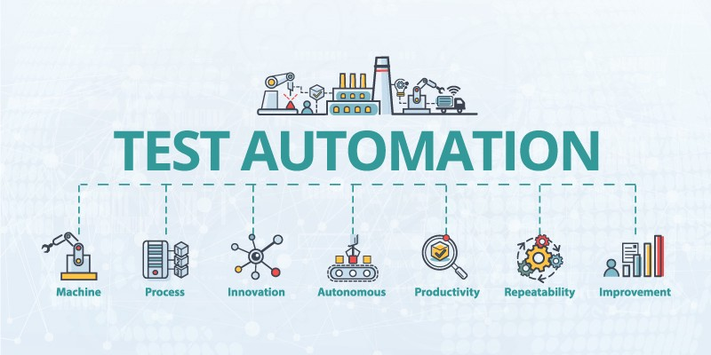
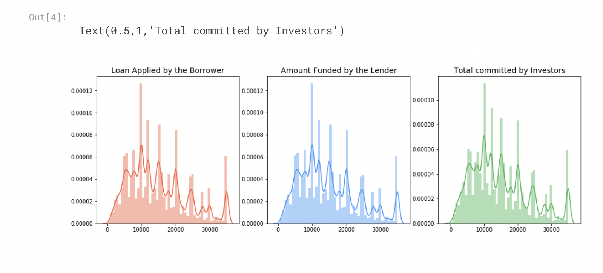

# Piyali Podder - Portfolio
---
## About :-

Technology professional with 10 years of IT experience in Automation & Manual Testing. To work devotedly for the organization with great pride in the profession where my knowledge transitioned and talents are encouraged. To contribute towards testing of complex application which makes use of my testing skills,devOps skills , project management & mentoring skills. Good at Analytical thinking and Code Debugging. Understand the Customer defects explained in Business perspective and provide equivalent technical solution to the errors.

## Employment History

 ### Accenture | October 2021 - present 

   Working as an individual contributor and team lead towards enhancement of existing Automation framework created for both UI and API Automation for client based Front end and back end applications hosted in Azure leveraging Core Java as the programming Language using Selenium Webdriver ,TestNG tools and other tools. Also maintaing and running pipeline from the repository maintained in GitLab.Upskilled and involved in DevOps task in running client inhouse Deploy tool for deployment of different versions in different environments.
   Also voluntered in data analysis task in visualizing data using different graphs,plots using Python.
   Involved in Sprint Planning,Sprint refinement and retrospective calls as QA Lead.
  
 ### Tata Consultancy Services | May 2016 - October 2021

   QA Lead for the offshore QA Team. Responsible for managing and planning work at offshore.
   Responsible for Automating different payment gateway services hosted in AWS Instances using Karate  Framework and also responsible for automating money transfer UI tool with open source Automation tools Selenium (Selenium WebDriver, Cucumber, JUnit, Eclipse,Page Object Model & Page Factory).
   Also,Involved in monitoring logs in AWS Cloud watch send via AWS API for different programs.
   Coordinated with client and onsite members and ensure that no slippages are there in the requirements and Interacted with the application owners and other stakeholders to understand the requirements.

### Cognizant Technology Solutions | August 2012 - May 2016 

   Involved in creation of Test Cases,Test Scenarios and Requirement traceability matrix and defects in HP-ALM tool for each use cases defined for different requirements.
   Performed Sanity,Functional and Regression testing Manually for Merchant Services applications for Acquiring business.

## Exploratory Data Analysis Assignment 

### Lending Club Case Study
Lending loans to ‘risky’ applicants is the largest source of financial loss (called credit loss). The credit loss is the amount of money lost by the lender when the borrower refusesto pay or runs away with the money owed.  
The main objective is to be able to identify these risky loan applicants, then such loans can be reduced thereby cutting down the amount of credit loss. 
Identification of such applicants using EDA is the aim of this case study. Perform an analysis to understand the driving factors (or driver variables)
behind loan default, i.e.the variables which are strong indicators of default.The company can utilise this knowledge for its portfolio and risk assessment. 

## Skills:-

<table>
<tr>
  <th>Skills</th>
  <th>Data<th>
</tr>
<tr>
  <td>Testing Tools & Frameworks</td>
  <td>Selenium 3 WebDriver,BDD Framework,Karate,TestNG,RestAssured basics</td>
</tr>  
<tr>
   <td>Programming Languages</td>
   <td>Java 11 Fundamentals,Java Collection basics,Java 8 basics,Python Basics,HTML</td>
<tr>
<tr>
    <td>IDE & Reporting Tools</td>
    <td>IntelliJ,Eclipse,Jupyter Notebook,Visual Studio</td>
</tr>
<tr>
    <td>Script Languages</td>
    <td>Unix & Shell Scripting basics,JavaScript Basics
 <tr>
 </tr>   
</table>

## Education

### B.Tech: Electrical Engineering
Future Institute of Engineering & Management - Kolkata, WB (2008-2012)

### EPGDS - AI & ML , IIIT Bangalore (2022 - 2024)

## Certifications

<table>
  <tr>
    <th>Certification Name</th>
    <th>Date</th>
  </tr>
  <tr>
    <td>Microsoft Certified:Azure Fundamentals</td>
    <td>2022-06</td>
  </tr>
  <tr>
    <td>Certified Tester Foundation Level (ISTQB)</td>
    <td>2014-04</td>
  </tr>
    <tr>
    <td>AWS Certified</td>
    <td>2019-08</td>
  </tr>
</table>
